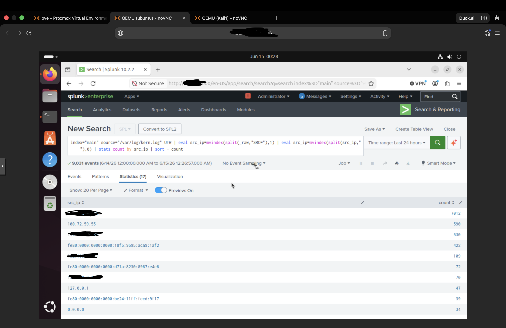
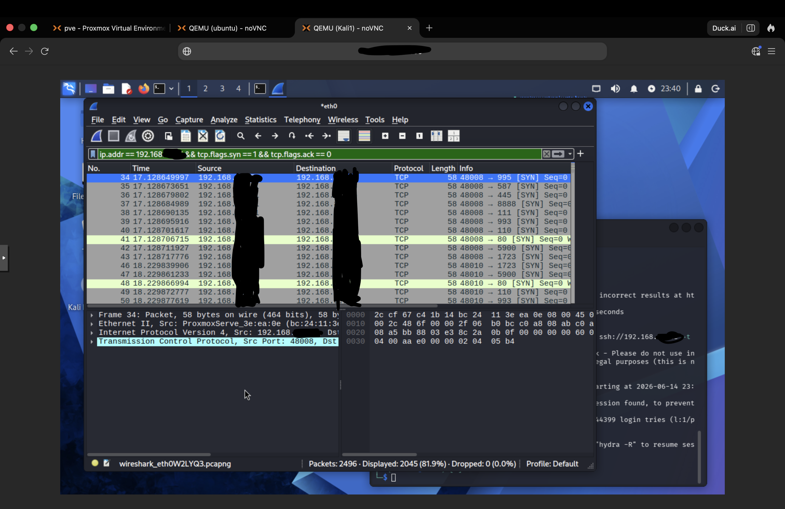
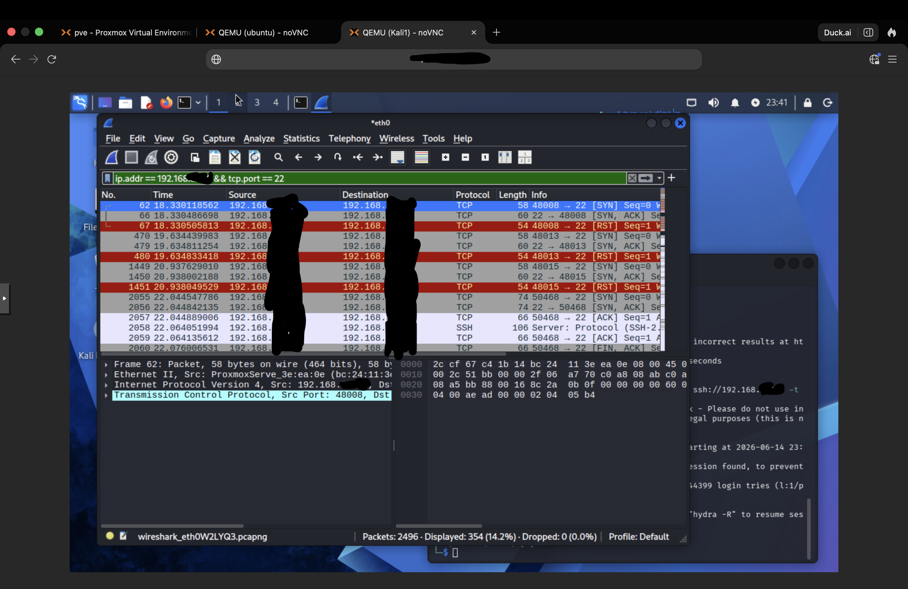
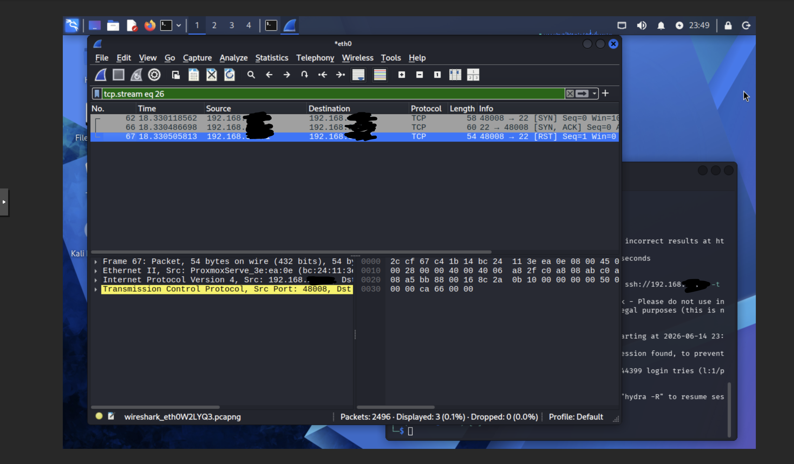
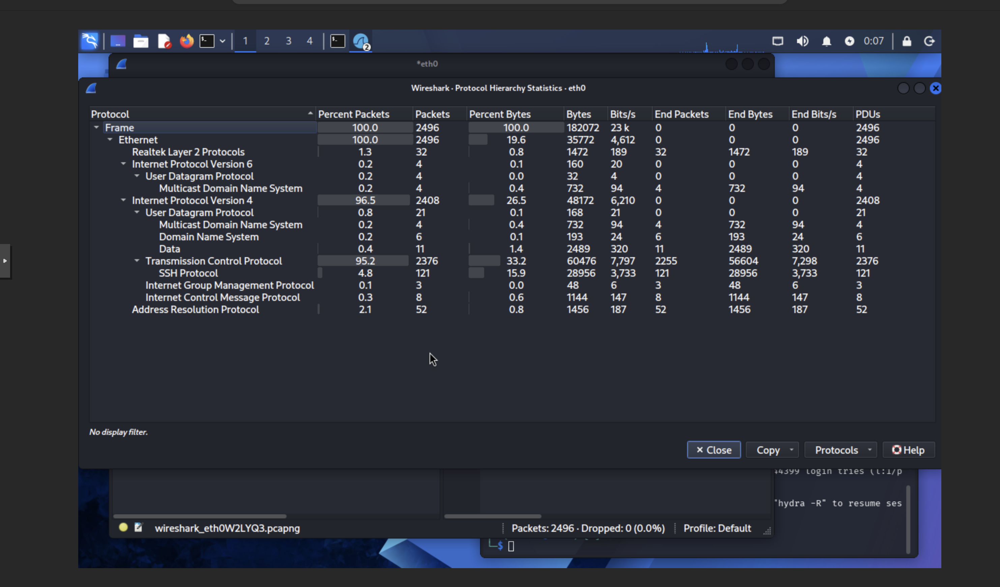
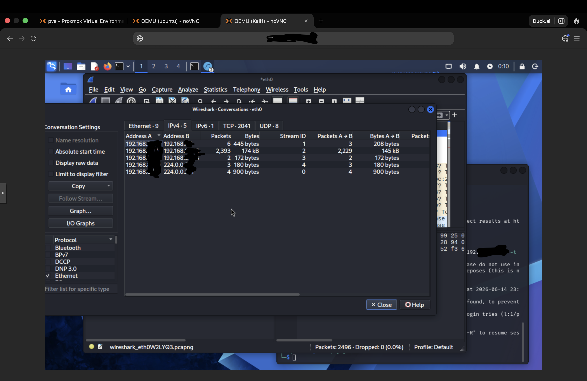

# 🔍 Network Traffic Monitoring and Attack Detection


## Objective
Perform real world network traffic analysis using Wireshark and Splunk SIEM to capture, analyze, and detect attack patterns from simulated Nmap reconnaissance and SSH brute force attacks. Demonstrate the real world SOC analyst workflow of starting from SIEM alerts, identifying suspicious IPs through log analysis, pivoting to packet level investigation, extracting Indicators of Compromise, and documenting findings in a formal forensic report.

---

## Real World Analyst Workflow

```
Alert fires in Splunk
        ↓
Analyst investigates suspicious IP from firewall logs
        ↓
Pivots to Wireshark for packet level analysis
        ↓
Confirms attack pattern from packet signatures
        ↓
Extracts IOCs from traffic and logs
        ↓
Documents findings in formal incident report
```

---

## Environment

| Component | Details |
|-----------|---------|
| SIEM | Splunk Enterprise on Ubuntu 24.04 VM |
| Hypervisor | Proxmox VE on HP EliteDesk |
| Victim Endpoint | Raspberry Pi 5 — Raspberry Pi OS |
| Attack Machine | Kali Linux VM on Proxmox |
| Packet Analyzer | Wireshark on Kali Linux |
| Firewall | UFW on Raspberry Pi 5 |
| Log Forwarder | Splunk Universal Forwarder |
| Network | Isolated homelab environment |

---

## Tools Used

| Tool | Purpose |
|------|---------|
| Wireshark | Packet capture and deep traffic analysis |
| Splunk Enterprise | SIEM — log analysis and suspicious IP identification |
| Nmap | Network reconnaissance simulation |
| Hydra | SSH brute force simulation |
| UFW | Linux firewall generating network block logs |
| Splunk Universal Forwarder | Real time log shipping to SIEM |

---

## Attacks Simulated

### 1. Network Reconnaissance — Nmap Scan
**MITRE ATT&CK:** T1046 — Network Service Discovery | T1595.001 — Scanning IP Blocks

```bash
nmap -A -O VICTIM-IP
```

### 2. SSH Brute Force — Hydra
**MITRE ATT&CK:** T1110.001 — Password Guessing

```bash
hydra -l root -P /usr/share/wordlists/rockyou.txt ssh://VICTIM-IP -t 4 -I
```

---

## Investigation Methodology

### Step 1 — SIEM Detection: Identify Suspicious IP
Started investigation from Splunk firewall logs — not from known attacker IP.
Used SPL to extract and rank source IPs by firewall hit count:

```spl
index=main source="/var/log/kern.log" UFW
| eval src_ip=mvindex(split(_raw,"SRC="),1)
| eval src_ip=mvindex(split(src_ip," "),0)
| stats count by src_ip
| sort - count
```

**Finding:** One internal IP generated 7,012 firewall block events — significantly higher than all other sources combined. This IP was immediately flagged as suspicious.



---

### Step 2 — Wireshark: Confirm Attack Pattern

Pivoted from Splunk to Wireshark using the suspicious IP identified in Step 1.

**Nmap Scan Signature — SYN Packet Flood:**

Filter applied:
```
ip.addr == VICTIM-IP && tcp.flags.syn == 1 && tcp.flags.ack == 0
```

**Finding:** Confirmed rapid sequential SYN packets targeting multiple destination ports within milliseconds — clear signature of automated port scanning.



---

**SSH Brute Force Signature — Repeated RST Packets:**

Filter applied:
```
ip.addr == VICTIM-IP && tcp.port == 22
```

**Finding:** Confirmed repeated SYN → SYN-ACK → RST pattern on port 22 — TCP reset packets indicate failed SSH authentication attempts consistent with brute force activity.



---

### Step 3 — TCP Stream Analysis

Followed TCP stream on SSH traffic to examine full conversation between attacker and victim.

**Finding:** Stream confirmed failed SSH handshake pattern repeating thousands of times — consistent with automated password guessing tool behavior.



---

### Step 4 — Protocol Hierarchy Analysis

**Finding:** TCP accounted for 95.2% of all captured traffic with 2,376 packets. SSH protocol generated 121 packets representing 15.9% of bytes. This traffic distribution is highly abnormal and consistent with active attack behavior rather than normal network usage.



---

### Step 5 — Conversation Analysis

**Finding:** A single IP pair accounted for 2,393 packets and 174 kB of traffic — the highest conversation volume by a significant margin. This confirms the suspicious IP identified in Splunk was the primary traffic source.



---

## IOC Extraction

| IOC Type | Value | Source | Confidence |
|----------|-------|--------|------------|
| Attacker IP | ATTACKER-IP | Splunk UFW logs + Wireshark | High |
| Target IP | VICTIM-IP | Splunk UFW logs + Wireshark | High |
| Target Service | SSH Port 22 | Wireshark packet capture | High |
| Attack Tool | Nmap + Hydra | Packet signature analysis | High |
| Scan Type | SYN scan — multiple ports | Wireshark SYN filter | High |
| Brute Force Pattern | SYN→SYN-ACK→RST repeating | Wireshark TCP stream | High |
| Firewall Events | 7,012 UFW block events | Splunk kern.log | High |
| SSH Attempts | 121 SSH packets captured | Wireshark SSH filter | High |
| Attack Duration | ~4 minutes | Wireshark timestamps | Medium |

---

## MITRE ATT&CK Coverage

| Technique ID | Name | Tactic | Detection Method |
|---|---|---|---|
| T1046 | Network Service Discovery | Discovery | UFW logs + Wireshark SYN packets |
| T1595.001 | Scanning IP Blocks | Discovery | UFW firewall blocks + packet analysis |
| T1110.001 | Password Guessing | Credential Access | Wireshark RST packets + auth.log |
| T1078 | Valid Accounts | Credential Access | SSH traffic analysis |

---

## Key Findings

- A single source IP generated 7,012 firewall block events — identified purely through SPL log analysis before any packet inspection
- Wireshark confirmed Nmap scan signature through rapid sequential SYN packets targeting multiple ports within milliseconds
- SSH brute force confirmed through repeating SYN→SYN-ACK→RST pattern on port 22
- TCP accounted for 95.2% of all captured traffic — abnormal distribution indicating active attack
- Mean Time to Detect from attack initiation to Splunk identification was under 3 minutes
- Attack chain confirmed: reconnaissance scan preceded SSH brute force — consistent with real world attacker behavior

---

## Detection Queries

See [splunk-queries/detection-queries.md](splunk-queries/detection-queries.md) for all SPL queries used.

---

## Incident Report

See [incident-reports/IR-2026-003-Network-Traffic-Analysis.md](incident-reports/IR-2026-003-Network-Traffic-Analysis.md) for the full forensic investigation report.

---

## Skills Demonstrated

- Network packet capture and analysis using Wireshark
- SPL-based suspicious IP identification from firewall logs
- Real world SOC investigation workflow — SIEM to packet analysis pivot
- TCP/IP protocol analysis and attack signature identification
- IOC extraction from network traffic
- MITRE ATT&CK framework mapping
- Forensic documentation and incident reporting

---

## References

- [Wireshark Documentation](https://www.wireshark.org/docs/)
- [MITRE ATT&CK Framework](https://attack.mitre.org)
- [Splunk Documentation](https://docs.splunk.com)
- [Nmap Documentation](https://nmap.org/docs.html)
